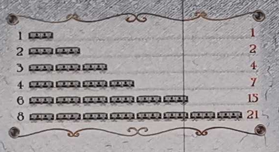

The goal of the homework is to count scores for the Ticket to Ride Europe board game. During the game, players connect different cities to complete some destination tickets. Every player has a set of train markers for claiming a route. At the end of the game, players got scores for claiming every route (=path between two neighboring cities) depending on its length:

